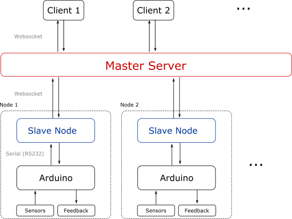

# lab-nanny

System to monitor signals from different labs and shares/acts on them remotely—just like a nanny.

The system consists on one or more [arduinos](https://www.arduino.cc/), each of them connected via USB to a PC (it could be a Raspberry PI), which are later connected to the network. Each of these (arduino+PC) *nodes* are then connected to a central server which different clients/users can connect to.

## Nodes
Each of the nodes consists of a bunch of channels connected to the arduino, plus a *slave* computer which communicates with both the arduino and the *master* server. 

Since the slave servers are directly connected to the arduinos, they show a much lower latency to their stimuli; one may use this to implement low-latency responses to contingencies. For example, if a TTL pulse signals that a potentially harmful condition is met, one might stop an experiment.

### arduino
The arduinos have both input and output ports, with which we can sense and act on the experiment respectively.

They communicate with the PCs connected to them via the serial port using a handshake. The handshake can either mean to just “send the sensor data” or to “perform an action and then send the sensor data”. Initially, this handshake just turns ON/OFF a particular digital port.

### slave server
It is in charge of periodically polling the arduino, asking for data, and sending the data back to the master server. It offers the possibility of both I/O to arduino from server requests.

## Master server
Periodically obtains data from all of the nodes. It may store this data (with low frequency) using a database.

The different clients should be able to subscribe to different sets of data.

## Notes for the server API:
- The request must be easy to code(something like “monitor1, ‘ch1’,’ch2’,’ch3’”, or maybe just the “monitor” part, and then each client selects the data
- There must be a way, in the server, to list the channels from the monitors (so that the requests from the clients can be compared to this list).
-The server needs to cope with connection loss (from any segment)
- Also, the server can save the data at intervals using mysql.

## Some sources:
Connection: http://www.benjaminmbrown.com/2016/02/tutorial-how-to-build-real-time-data-visualization-with-d3-crossfilter-and-websockets-in-python-by-example/

Feedback: http://www.instructables.com/id/Raspberry-Web-server-sending-GET-data-to-Arduino-N/step2/Setting-up-a-RaspberryPi-as-a-WAP-web-server-and-j/

General "create graph" pattern: https://gist.github.com/benjchristensen/1148374

websocket: https://www.toptal.com/tornado/simple-python-websocket-server, http://www.html5rocks.com/en/tutorials/websockets/basics/

realtime python: http://mrjoes.github.io/2013/06/21/python-realtime.html