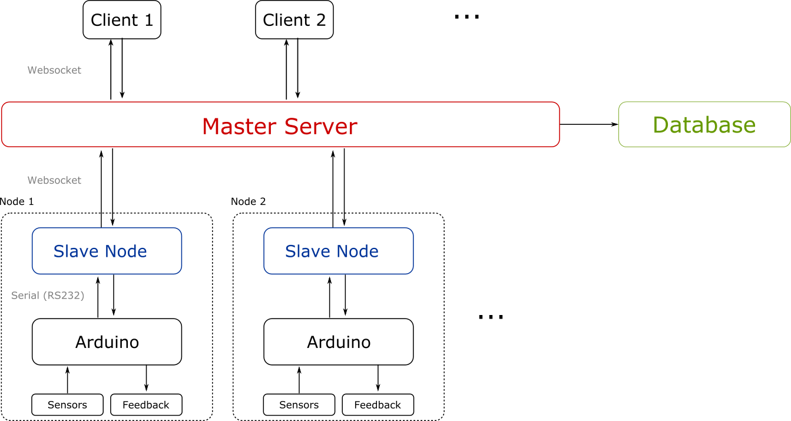

# lab-nanny

System to monitor signals from different labs and shares/acts on them remotely—just like a nanny.

The system consists on one or more [arduinos](https://www.arduino.cc/), each of them connected via USB to a PC (it could be a Raspberry PI), which are later connected to the network. Each of these (arduino+PC) *nodes* are then connected to a central server which different clients/users can connect to.

## Nodes
Each of the nodes consists of a bunch of channels connected to the arduino, plus a *slave* computer which communicates with both the arduino and the *master* server.

Since the slave nodes are directly connected to the arduinos, they show a much lower latency to their stimuli; one may use this to implement low-latency responses to contingencies. For example, if a TTL pulse signals that a potentially harmful condition is met, one might stop an experiment.

### arduino
The arduinos have both input and output ports, with which we can sense and act on the experiment respectively.

They communicate with the PCs connected to them via the serial port using a handshake. The handshake can either mean to just “send the sensor data” or to “perform an action and then send the sensor data”. Initially, this handshake just turns ON/OFF a particular digital port.

### Slave nodes (servers.server_node)
It is in charge of polling the arduino, asking for data, and sending the data back to the master server. It offers the possibility of both I/O to arduino from server requests.

## Master server (servers.server_master)
Periodically obtains data from all of the nodes. It may store this data (with low frequency) using a database.

## Clients
Coded in HTML + JS. Connect to the master-server, which then sends the data to all connected clients every time the slave nodes sends data back.

# How to run
For testing purposes, one can run a master server and a slave node in the same machine.
In the lab-nanny folder, execute
~~~~
python -m servers.server_master
~~~~
And execute a slave node:
~~~~
python -m servers.server_node --emulate 1 -r lab6
~~~~

One can then see the results through the navigator.
First, open a server in the lab-nanny folder using
~~~~
python -m SimpleHTTPServer 3000
~~~~
which will start serving in http://localhost:3000. Then, go to the "clients" folder, and use the "datavis-master.html".